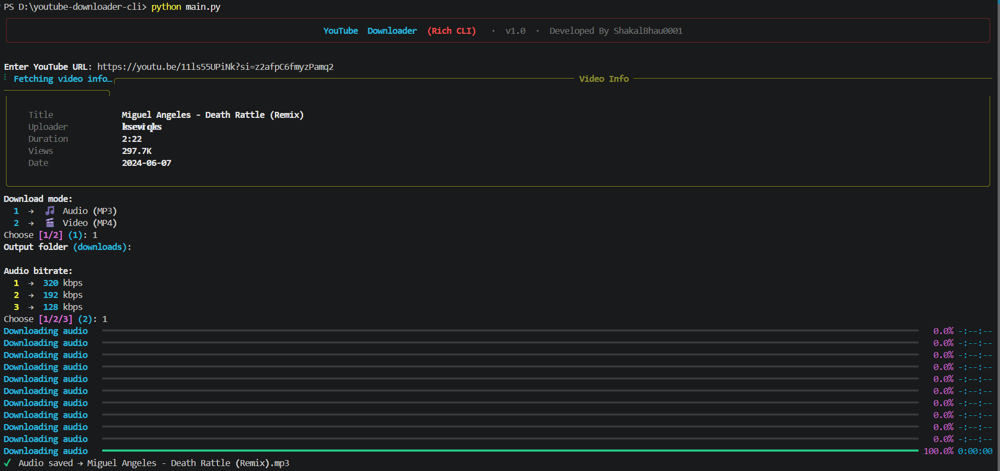
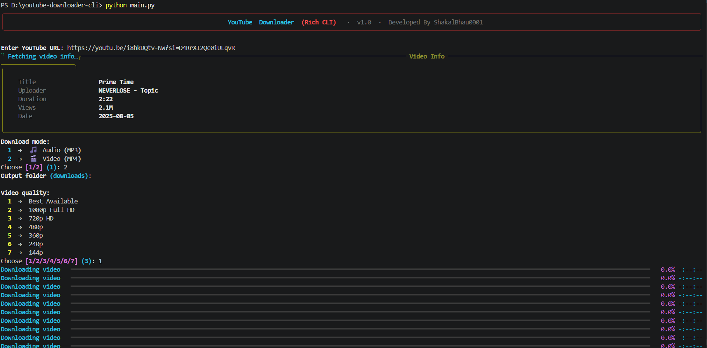
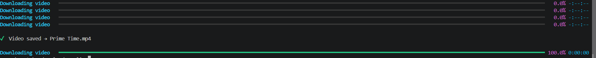

# 📥 Youtube Downloader CLI

### YouTube Audio & Video Downloader — Rich CLI powered by yt-dlp

**Youtube Downloader CLI** is a fast, clean, and feature-rich **YouTube downloader** built entirely in **Python (3.12.x compatible)**.
It is designed for **developers, power users, and terminal enthusiasts** who prefer scripting and CLI workflows over browser extensions or bloated GUI apps.
Using simple and consistent commands, users can:
  - Download YouTube videos in best available quality (MP4)
  - Extract audio from YouTube videos (MP3)
  - Choose between interactive mode or direct CLI flags
  - Track download progress with a beautiful Rich-powered terminal UI

All operations run **fully locally** with **zero background services** — no accounts, no tracking, no nonsense.

---

## 🖥️ Looking for a GUI Version?

If you prefer a clean, beginner-friendly graphical interface instead of terminal commands:

👉 A **GUI version** with a modern desktop UI built using CustomTkinter is also available.

> **🔗 GUI Repository: [youtube-downloader-gui](https://github.com/ShakalBhau0001/youtube-downloader-gui)**


---

## ✨ Key Philosophy

youtube-downloader-cli follows three strict principles:

1. **Simplicity-first** – one command, one result, no clutter
2. **CLI-friendly** – clean flags, interactive fallback, predictable output paths
3. **Modular architecture** – core download logic isolated from CLI layer

This is **not a wrapper script**. The codebase is structured, maintainable, and independently extensible.

---

## 🧩 Included Modules

### 🎬 Video Download (MP4)

Download full YouTube videos in the best available quality.

**Features**

* Automatic best-quality format selection
* Saves as `.mp4`
* Supports short URLs, full URLs, and playlist videos
* Progress bar via Rich

**Use-case**

> Offline video archival, lecture downloads, content backup

---

### 🎵 Audio Extraction (MP3)

Download only the audio track from any YouTube video.

**Features**

* Extracts audio via yt-dlp post-processing
* Saves as `.mp3`
* Video downloads work without FFmpeg, but MP3 conversion requires FFmpeg.
* Clean filename from video title

**Use-case**

> Podcast downloads, music archival, lecture audio

---

### 🖥️ Interactive Mode

Launch the tool with no arguments to enter a guided interactive session.

**Features**

* Prompts for URL, format choice, and output path
* Keyboard-interrupt safe (`Ctrl+C` handled gracefully)
* Ideal for one-off downloads without memorizing flags

**Use-case**

> Casual use, quick downloads without looking up flags

---

## 📁 Project Structure

```bash
youtube-downloader-cli/
│
├── assets/
├── core/
│   ├── __init__.py
│   └── downloader.py
│
├── cli/
│   ├── __init__.py
│   ├── commands.py
│   ├── display.py
│   └── interactive.py
│
├── main.py
├── requirements.txt
├── LICENSE
└── README.md
```

> ✔ Core download logic and CLI interface are **strictly separated** for maintainability and extensibility.

---

## 🧪 Tech Stack

| Component        | Implementation            |
| ---------------- | ------------------------- |
| Downloader Core  | yt-dlp                    |
| CLI Framework    | argparse                  |
| Terminal UI      | Rich (progress, styling)  |
| Interactive Mode | Built-in prompt flow      |
| Language         | Python 3.12.x             |
| Media Processing | FFmpeg                    |

---

## 🚀 Getting Started

### 1️⃣ Clone Repository

```bash
git clone https://github.com/ShakalBhau0001/youtube-downloader-cli.git
cd youtube-downloader-cli
```

### 2️⃣ Install Dependencies

```bash
pip install -r requirements.txt
```

**requirements.txt**

```txt
rich
yt-dlp
```

_No unnecessary or hidden dependencies_

---

### 3️⃣ Install FFmpeg

FFmpeg is required for:

* MP3 audio extraction
* Audio conversion and post-processing
* Bitrate selection support

Without FFmpeg, video downloads will work normally, but audio downloads and MP3 conversion may fail.

---

#### Windows

1️⃣ Download FFmpeg from:   **[FFmpeg](https://ffmpeg.org/download.html)**

2️⃣ Extract the downloaded archive.

3️⃣ Locate the `bin` folder.

4️⃣ Add the `bin` folder to your system `PATH`.

5️⃣ Verify installation:

```bash
ffmpeg -version
```

**OR**

> **Use Following Command Into Terminal (Run As Administrator) :**

```bash
winget install Gyan.FFmpeg
```

---

#### Linux

```bash
sudo apt install ffmpeg
```

---

#### macOS

```bash
brew install ffmpeg
```

---

### Verify Installation

```bash
ffmpeg -version
```

If FFmpeg is installed correctly, version information will be displayed.

---

### 3️⃣ Run Help Command

```bash
python main.py --help
```

This will display all available flags and usage instructions.

---

## 🧪 CLI Usage Examples

> **Syntax**
> 
> `python main.py "<youtube_url>" [OPTIONS]`

---

## 🎬 Video Download (MP4)

### Download (short flags)

```bash
python main.py "<youtube_url>" -m video
```

### Download (long flags)

```bash
python main.py "<youtube_url>" --mode video
```

### Download in 1080p

```bash
python main.py "<youtube_url>" -m video -q 1080p
```

### Download in 720p

```bash
python main.py "<youtube_url>" -m video -q 720p
```

### Download in 480p

```bash
python main.py "<youtube_url>" -m video -q 480p
```

### Download in 360p

```bash
python main.py "<youtube_url>" -m video -q 360p
```

### Download in 240p

```bash
python main.py "<youtube_url>" -m video -q 240p
```

### Download in 144p

```bash
python main.py "<youtube_url>" -m video -q 144p
```

---

## 🎵 Audio Download (MP3)

### Download (short flags)

```bash
python main.py "<youtube_url>" -m audio
```

### Download (long flags)

```bash
python main.py "<youtube_url>" --mode audio
```

### Download 320kbps Audio

```bash
python main.py "<youtube_url>" -m audio -b 320
```

### Download 192kbps Audio

```bash
python main.py "<youtube_url>" -m audio -b 192
```

### Download 128kbps Audio

```bash
python main.py "<youtube_url>" -m audio -b 128
```

---

## 📂 Custom Output Directory

### Specify output path (short flags)

```bash
python main.py "<youtube_url>" -m video -o ./downloads
```

### Specify output path (long flags)

```bash
python main.py "<youtube_url>" --mode video --output ./downloads
```

## ℹ️ Fetch Video Information

Display video information without downloading.

### Short Flag

```bash
python main.py "<youtube_url>" -i
```

### Long Flag

```bash
python main.py "<youtube_url>" --info
```

---

## 🆘 Help Command

```bash
python main.py --help
```

> Displays all available command-line options and usage instructions

---

## 🖥️ Interactive Mode

Run with no arguments to enter guided mode:

```bash
python main.py
```

You will be prompted to enter:
- YouTube URL
- Format choice (`video` or `audio`)
- Output directory

---

## ⚠️ Important Notes

- `--mode` accepts `video` or `audio` only
- If no URL is provided, interactive mode launches automatically.
- `Ctrl+C` exits cleanly at any point
- Output files are named automatically from the `video title`
- `Short` and `long flags` both work identically

---

## ⚠️ Disclaimer

> This tool is intended for **personal, educational, and research use only**.
> **_Downloading copyrighted YouTube content without permission may violate YouTube's Terms of Service._**
> The developer is **not responsible** for any misuse of this tool.
> **Always respect content creators and platform policies.**

---

## 🛣️ Roadmap

- Playlist batch download support
- Download history log
- PyInstaller standalone binary
- Linux & macOS packaging

---

## 📸 Preview

### 1. Audio Download



### 2. Video Download




---

## 🪪 Author

> **Developer: Shakal Bhau**

> **GitHub: [ShakalBhau0001](https://github.com/ShakalBhau0001)**

---

> "The terminal is not a limitation — it's a superpower."

---

## ⭐ Support

If you like this project, consider giving it a ⭐ on GitHub!

---
